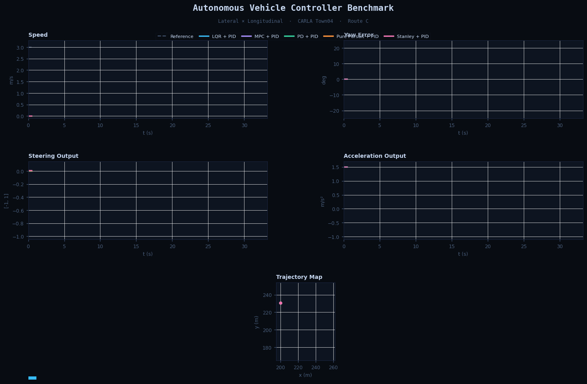
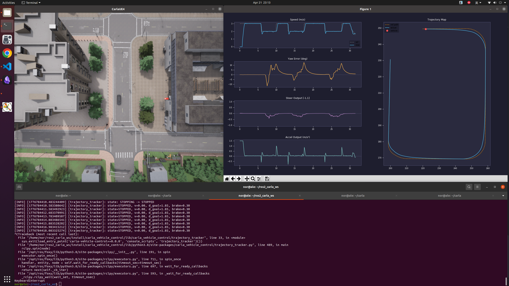
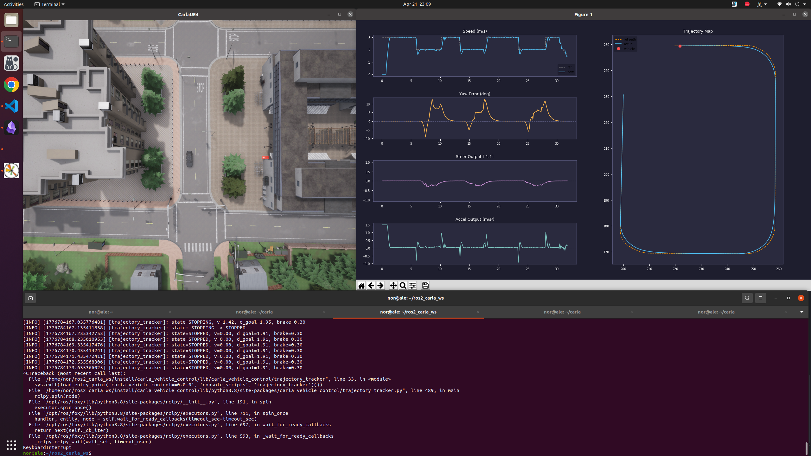
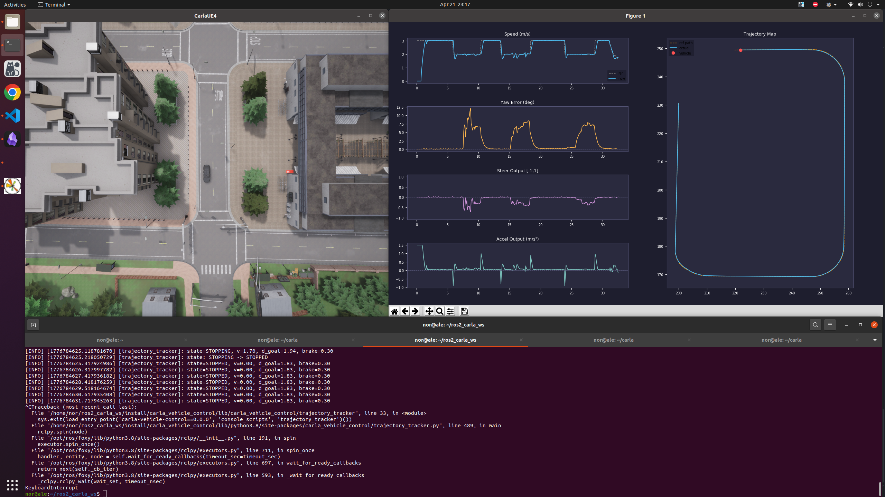

# carla_vehicle_control

基于 CARLA + ROS 2 的轨迹跟踪控制，支持多种横向控制器的快速切换与对比测试。

给定一条离线参考轨迹，控制 `ego_vehicle` 在 `Town04` 里稳定跑完。  
输入是 `route_X.csv`，输出是 CARLA 的油门、刹车、转向命令。

---

## 交互式可视化



--- 

## 当前实现

- 地图固定在 `Town04`，车辆为 `vehicle.lincoln.mkz_2020`
- 参考轨迹支持 `A / B / C` 三条路线
- 横向控制器：`PD` / `Pure Pursuit` / `Stanley` / `LQR` / `MPC`
- 纵向控制器：`PID`（输出目标加速度，走二维标定表映射油门）
- 控制节点带 `WAITING → DRIVING → STOPPING → STOPPED` 状态机
- 实时 matplotlib 可视化：速度、航向误差、控制输出、轨迹图

---

## 演示

### Stanley + PID


### Pure Pursuit + PID


### PD + PID


### LQR + PID


### MPC + PID


---

## 控制器对比

路线 C（环形多弯道），纵向统一用 PID，横向控制器对比如下：

| 横向控制器 | 完成用时 (s) | 速度 RMSE (m/s) | 最大偏航误差 (°) | 平均偏航误差 (°) | 转向平滑度 (avg \|Δsteer\|) |
|:----------:|:------------:|:---------------:|:----------------:|:----------------:|:----------------------------:|
| LQR        | 32.5         | 0.507           | 12.08            | 2.08             | 0.0306                       |
| MPC        | 32.4         | 0.499           | 10.73            | **1.91**         | 0.0196                       |
| PD         | 33.2         | **0.491**       | 21.67            | 2.36             | 0.0377                       |
| Pure Pursuit | 31.8       | 0.508           | 12.56            | 2.33             | **0.0082**                   |
| Stanley    | **31.5**     | 0.506           | 12.86            | 2.58             | 0.0096                       |

> 速度 RMSE 越小越好；最大/平均偏航误差越小越好；转向平滑度越小说明方向盘抖动越少。

---

## 环境

- Ubuntu 20.04 / ROS 2 Foxy / CARLA 0.9.13
- `carla_ros_bridge`、`carla_spawn_objects`
- Python：`PyYAML`、`numpy`、`matplotlib`

`.bashrc` 相关配置：

```bash
source /opt/ros/foxy/setup.bash
source ~/ros2_carla_ws/install/setup.bash
export CARLA_ROOT=~/carla
export PYTHONPATH=$PYTHONPATH:$CARLA_ROOT/PythonAPI/carla/dist/carla-0.9.13-py3.7-linux-x86_64.egg:$CARLA_ROOT/PythonAPI/carla

# 别名
alias launch_scene='ros2 launch carla_vehicle_control spawn_scene.launch.py'
alias start_carla='bash ~/.tmux-carla.sh'

carla() {
    cd ~/carla || return
    ./CarlaUE4.sh
}
```

---

## 快速开始

先编译：

```bash
cd ~/ros2_carla_ws
colcon build --packages-select carla_vehicle_control
source install/setup.bash
```

在 `config/controller_params.yaml` 里选好横向控制器，然后分别开几个终端：

**终端 1 — 启动 CARLA**

```bash
carla
```

**终端 2 — 生成场景和 ego 车**

```bash
launch_scene route:=C   # A / B / C
```

**终端 3 — 启动控制节点**

```bash
ros2 run carla_vehicle_control trajectory_tracker --ros-args -p route:=C
```

**终端 4 — 启动可视化**

```bash
ros2 run carla_vehicle_control visualizer route:=C
```

**终端 5 — 发送启动信号**

```bash
ros2 topic pub --once /carla_viz/start std_msgs/Bool "data: true"
```

> 注意：`spawn_scene`、`trajectory_tracker`、`visualizer` 三边的 `route` 要保持一致。

录屏：`Ctrl+Shift+Alt+R`，如果默认 30 秒不够用，先执行：

```bash
gsettings set org.gnome.settings-daemon.plugins.media-keys max-screencast-length 600
```

---

## 控制器切换

编辑 [`config/controller_params.yaml`](config/controller_params.yaml)：

```yaml
trajectory_tracker:
  lat_ctrl: "lat_st"   # lat_pd / lat_pp / lat_st / lat_lqr / lat_mpc
  lon_ctrl: "lon_pid"
```

---

## 三条路线

| 路线 | 点数 | 长度 | 用途 |
|:----:|-----:|-----:|:-----|
| A    | 355  | 179.15 m | 纯直道，纵向 baseline |
| B    | 297  | 146.27 m | 直道 + 弯道，横纵综合 |
| C    | 434  | 226.14 m | 环形多弯道，横向压力测试 |

轨迹 CSV 字段：`s, x, y, yaw, kappa, speed`

---

## 纵向标定

纵向不是"PID 输出直接当油门"，而是先做了二维标定表：

- 行：油门开度，列：速度区间，表值：该条件下平均加速度

运行时逻辑：`lon_pid` 算出目标加速度 → `_interp_2d()` 查表反查油门 → 叠加速度相关前馈补偿。

标定表：[`config/calibration_table.csv`](config/calibration_table.csv)

---

## 目录结构

```text
carla_vehicle_control/
├── carla_vehicle_control/
│   ├── controllers/         # 各控制器实现
│   ├── scenarios/           # 场景管理 & 轨迹生成
│   ├── utils/               # 标定工具
│   ├── trajectory_tracker.py
│   └── visualizer.py
├── config/                  # 参数、路线、标定表
├── results/
│   ├── controller_benchmark.html   # 交互式对比图
│   ├── data/                # 各控制器原始 CSV
│   ├── pic/                 # 截图
│   └── video/               # 录制视频
├── launch/
└── test/
```
